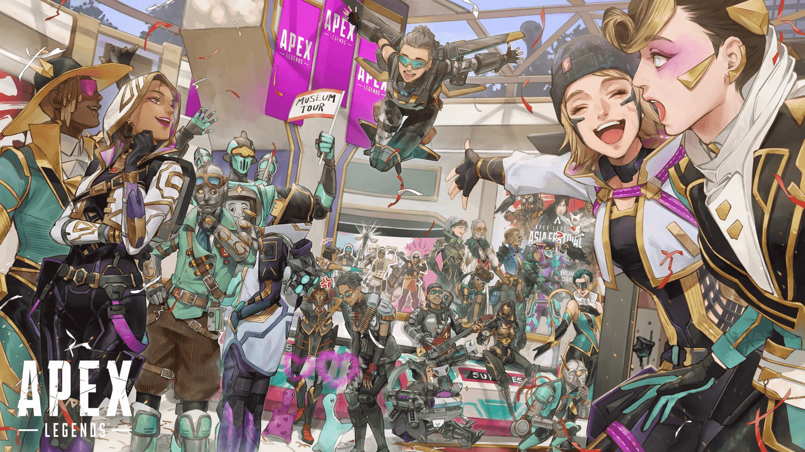

The day Dad passed was also the day of the Ring's public unveiling.

He should have been on stage watching the Ring being completed. But he wasn't. That morning, the Syndicate's health officer informed me — he was gone.

He died of cardiac arrest. In his bed. Next to his electrical engineering manual.

*The book was still open to the fence sketches I drew when I was 15.*

## The Funeral

I stood in the corner all day. No — I wasn't standing, I was crouching. Under a table in the back of the church. Arms wrapped around my knees.

I always thought silence was what I wanted. But when the kitchen went quiet, when the whole house felt like it had been unplugged — I understood that **silence is a kind of fear.**

Not a single crackle of static.

## Those Who Found Me

The first person to look under the table was **Bangalore** (Anita). She didn't say anything, just crouched next to me for about five minutes. The weight of her crouching felt like a shield.

Then **Gibraltar** (Makoa). He couldn't crouch — he was too big — so he sat on the floor. "Hey, little spark," he said. "That's a pretty tight spot under there. You gotta come out."

**Lifeline** (Ajay) brought bandages and hot chocolate. My hands were covered in nail marks from digging into my own knees. She looked at me, shoved the chocolate into my hands, and started bandaging me up.

The last one — the one I didn't expect — **Caustic** (Dr. Nox). He didn't say anything. He just stood in the corner, watching the others comfort me. His gloomy eyes told me one thing:

*"I won't comfort you. But if you touch me — I'll shock you."*

**…Wait, that's my line.**

But I understood. He had lost a friend too. He was my father's friend.

## Today

These people are Apex Legends. They shoot each other in the arena, greet each other with electric fences and bullets. But to me — they're my uncles and aunts. My family.

Dad used to say: "Current always takes the shortest path."

*But family isn't current. Family is the people who come back to you no matter how long the path is.*

> *"I learned what family means. Turns out my equation was missing a variable. My family — is here. In the arena."*

⚡ Wattson
