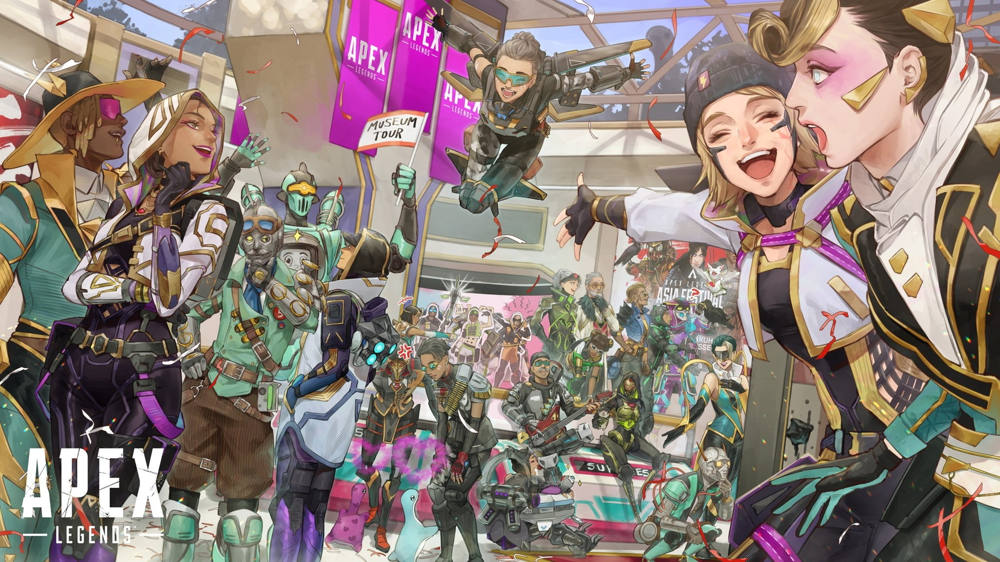

爸爸走的那一天，正好是安全区公开展示的日子。

他应该在台上看到那座安全区落成。但他没有。那天早上，辛迪加的卫生官通知我——他离开了。

他死于心脏骤停。在床头。在他的电气工程手册旁边。

*那本书上还翻开着我15岁时画的围栏草图。*

## 葬礼

那天我一直站在角落里。不对——不是站着，是蹲着。在教堂后面的桌子底下。手抱着膝盖。

我一直以为安静是我想要的。但当厨房安静下来，整个房子像被拔掉了电源——我才理解，**安静是一种恐惧**。

一声静电的噼啪都没有了。

## 找到我的那些人

第一个低下头看桌子底下的，是**班加罗尔**（Anita）。她什么都没说，只是在我旁边蹲了大概五分钟。她蹲下来的份量，像一个盾牌。

然后是**直布罗陀**（Makoa）。他蹲不下来——他太大了——所以他坐在了地板上。"嘿，小电。"他说。"桌子底下有点窄，你得出来。"

**生命线**（Ajay）带来了绷带和热巧克力。我的手上全是掐自己膝盖留下的指甲印。她看了我一眼，把巧克力塞进我手里，开始包我的手。

最后一个——我没想到的人——**腐蚀**（诺克斯博士）。他没有说话。他只是站在角落，看着其他人在安慰我。他阴沉的眼神告诉我一件事：

*"我不会安慰你。但如果你碰我——我就电你。"*

**……等等，这是我的台词。**

但我懂了。他也失去了一个朋友。他是我爸爸的朋友。

## 今天

这些人是 Apex 的传奇。他们在竞技场里互相射击，用电网和子弹打招呼。但对我来说——他们是我的叔叔和阿姨。我的家人。

爸爸以前常说："电流只走最短的路径。"

*但家庭不是电流。家庭是不管多长的路径都会回到你身边的人。*

> *"我学会了什么是家庭。原来我的方程式缺了一个变量。我的家庭——在这里。在竞技场。*"

⚡ Wattson
