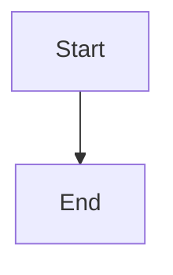

A tutorial and reference for writing Markdown files, covering core syntax and common extensions (GFM).

# Markdown Overview

## Markdown

Markdown is a lightweight markup language that allows people to write structured documents in a plain text format that is easy to read and write.

The Markdown language was created in 2004 by John Gruber in collaboration with Aaron Swartz and is widely used on websites.

## CommonMark

[CommonMark](https://commonmark.org/) is a rigorous, unambiguous syntax specification and test suite for Markdown.

Its core goal is to solve the problem of fragmented "dialects" and inconsistent cross-platform rendering caused by the original Markdown's unclear specification.

## GFM

GitHub Flavored Markdown, commonly abbreviated as [GFM](https://gfm.docschina.org/), is a Markdown dialect currently supported for user content on GitHub.com and GitHub Enterprise.

GFM is a strict superset of CommonMark. All features supported in GitHub user content that are not specified in the original CommonMark specification are therefore called **extensions** and highlighted as such.

# Headings

Markdown headings come in two formats:

Use `=` for level-1 headings and `-` for level-2 headings.

```markdown
Level-1 Heading
=================

Level-2 Heading
-----------------

```

Use `#` symbols for headings.

```markdown
# Level-1 Heading
## Level-2 Heading
### Level-3 Heading
#### Level-4 Heading
##### Level-5 Heading
###### Level-6 Heading
```

Level-2 Heading
-----------------

### Level-3 Heading

#### Level-4 Heading

##### Level-5 Heading

###### Level-6 Heading

---

# Paragraphs

## Paragraphs

Use a blank line after a paragraph to indicate the start of a new paragraph.

```markdown
First paragraph

Second paragraph
```

First paragraph

Second paragraph

## Line Breaks

Add two or more spaces at the end of a line to indicate a line break, similar to using the HTML line break tag `<br>`.

```markdown
First line  
Second line<br>Third line
```

First line  
Second line<br>Second line

> Use paragraph markers whenever possible, and avoid or minimize line break markers.

# Text and Emphasis

## Italic

Italic text indicates emphasis or citation, commonly used for book titles, foreign words, etc.

Italic syntax uses a single asterisk `*` or a single underscore `_` to surround the text.

```markdown
*italic text*

_italic text_
```

*italic text*
_italic text_

> It is recommended to add spaces before and after emphasis markers for better readability.

## Bold

Bold text makes important information stand out.

Bold syntax uses double asterisks `**` or double underscores `__` to surround the text.

```markdown
**bold text**

__bold text__
```

**bold text**

__bold text__

> It is recommended to add spaces before and after emphasis markers for better readability.

## Bold & Italic Combined

Combined bold and italic uses triple asterisks `***` or triple underscores `___` to surround the text.

```markdown
***bold italic***

___italic bold text___
```

***bold italic***
___italic bold text___

> It is recommended to add spaces before and after emphasis markers for better readability.

## Strikethrough

Place two tildes `~~` on both sides of a word to indicate that the text is outdated or deleted.

```markdown
Normal text

~~deleted text~~
```

Normal text

~~deleted text~~

## Underline

Markdown has no built-in underline syntax, but it can be achieved using the HTML tag `<u>`.

Underlining may interfere with reading, so it should be used sparingly.

```markdown
<u>underlined text</u>
```

<u>underlined text</u>

## Highlight

Text highlighting is not standard Markdown syntax, but many extensions support it, or it can be achieved through HTML:

```
This is ==highlighted text==

This is <mark>highlighted text</mark>
```

This is ==highlighted text==

This is <mark>highlighted text</mark>

# Lists

Markdown supports ordered and unordered lists.

## Unordered Lists

Unordered lists use asterisks `*`, plus signs `+`, or hyphens `-` as list markers. These markers should be followed by a space and then the content.

```markdown
* Item 1
* Item 2
* Item 3

+ Item 1
+ Item 2
+ Item 3

- Item 1
- Item 2
- Item 3
```

* Item 1
* Item 2
* Item 3

+ Item 1
+ Item 2
+ Item 3

- Item 1
- Item 2
- Item 3

> Recommendations:
>
> 1. Use hyphens `-` consistently as they are visually clearer
> 2. Keep a consistent marker style within the same document

## Ordered Lists

Ordered lists use numbers followed by a period `.`.

```markdown
1. Item 1
2. Item 2
3. Item 3
```

1. Item 1
2. Item 2
3. Item 3

Markdown will start from the first number and auto-correct the numbering sequence.

```markdown
4. Item 4
6. Item 6 (renders as 5)
8. Item 8 (renders as 6)
```

4. Item 4
6. Item 6 (renders as 5)
8. Item 8 (renders as 6)

## Nested Lists

To nest lists, simply add four spaces before the items in the sub-list.

```markdown
1. Item 1:
    - Sub-item 1
        1. Sub-sub-item 1
        2. Sub-sub-item 2
    - Sub-item 2
2. Item 2:
    1. Sub-item 1
    2. Sub-item 2
```

1. Item 1:
    - Sub-item 1
        1. Sub-sub-item 1
        2. Sub-sub-item 2
    - Sub-item 2
2. Item 2:
    1. Sub-item 1
    2. Sub-item 2

> Recommendations:
>
> 1. Sub-lists need 2-4 spaces of indentation
> 2. Keep a consistent indentation width
> 3. Nesting can be unlimited, but it is recommended not to exceed 3 levels in practice

## Task Lists

Task lists add `- [ ]` before list items to create checkable lists.

```markdown
- [ ] Unchecked
- [x] Checked
```

- [ ] Unchecked
- [x] Checked

# Blockquotes

Blockquotes are used to highlight important information, quote others' opinions, or create visual hierarchy.

## Blockquotes

Blockquotes use the `>` symbol at the beginning of a paragraph, followed by a **space**:

Other syntax elements can be used **inside** blockquotes.

```markdown
> This is quoted content
> This is quoted content
> This is quoted content
>
> Lists inside blockquotes:
>
> 1. Item 1
> 2. Item 2
>    1. Element 1
>    2. Element 2
>
> Code inside blockquotes:
>
> ``` bash
> echo hello world
> ```
```

> This is quoted content
> This is quoted content
> This is quoted content
>
> Lists inside blockquotes:
>
> 1. Item 1
> 2. Item 2
>    1. Element 1
>    2. Element 2
>
> Code inside blockquotes:
> ```bash
> echo hello world
> ```

## Blockquotes Inside Lists

If you want to put a blockquote inside a list item, you need to indent the `>` with four spaces.

```markdown
1. Item 1
   > Blockquote
2. Item 2
   > Blockquote
```

1. Item 1
   > Blockquote
2. Item 2
   > Blockquote

## Nested Blockquotes

One `>` symbol represents the outermost level; two `>` symbols represent the first level of nesting.

```markdown
> Outermost
> > First level of nesting
> > > Second level of nesting
```

> Outermost
> > First level of nesting
> > > Second level of nesting

# Code

## Inline Code

If you mention a function or code fragment within a paragraph, wrap it in backticks.

```
In this paragraph we mentioned the `print()` function
```

In this paragraph we mentioned the `print()` function

## Backtick Escaping

When you need to display backticks or other special characters within inline code, you need to escape them.

Use multiple backticks to wrap a backtick.

```
``Multiple backticks ` to wrap ``
```

``Multiple backticks ` to wrap ``

> Backslash escaping cannot be used in inline code

## Indented Code Blocks

Indented code blocks use 4 spaces or one tab.

```markdown
Normal paragraph

    This is an indented code block
    Each line has four spaces in front
    Preserving the original formatting

Normal paragraph
```

Normal paragraph

    This is an indented code block
    Each line has four spaces in front
    Preserving the original formatting

Normal paragraph

## Fenced Code Blocks

You can wrap a block of code with **```** and optionally specify a language:

~~~markdown
```
Multiple lines of code
Can contain blank lines
Preserves original indentation
```
```txt
Plain text
```
```java
public class TestCode() {
    public static void main(String[] args) {
        System.out.println("Hello World");
    }
}
```
```javascript
$(document).ready(function () {
    alert('RUNOOB');
});
```
~~~

```
Multiple lines of code
Can contain blank lines
Preserves original indentation
```
```txt
Plain text
```
```java
public class TestCode() {
    public static void main(String[] args) {
        System.out.println("Hello World");
    }
}
```
```javascript
$(document).ready(function () {
    alert('RUNOOB');
});
```

# Links

Link syntax provides interactive navigation capabilities for Markdown documents.

## Using Brackets `[]` and Parentheses `()`

```markdown
This is a link [baidu](https://www.baidu.com "Link title")
```

This is a link [baidu](https://www.baidu.com "Link title")

## Using Angle Brackets `<>`

```markdown
This is a link <https://www.baidu.com>
```

This is a link <https://www.baidu.com>

## Automatic Link Detection

Modern Markdown parsers usually support automatic detection of URLs and email addresses.

```markdown
Website: https://www.example.com

Email: example@email.com
```

Website: https://www.example.com
Email: example@email.com

> Automatic detection depends on the specific Markdown parser. To ensure compatibility, it is recommended to use standard link syntax.

## Reference Links

You can set a link using a variable, with the variable assignment at the end of the document, similar to footnotes.

```markdown
This link uses [a] in the second bracket as the URL variable [google][g]

This link omits the second bracket as the URL variable [baidu][]

[g]: http://www.google.com/
[baidu]: https://www.baidu.com/
```

This link uses [a] in the second bracket as the URL variable [google][g]

This link omits the second bracket as the URL variable [baidu][]

[g]: http://www.google.com/
[baidu]: https://www.baidu.com/

## Anchor Links

Anchor links are used to jump within the same document, especially suitable for navigating long documents. <span id="custom-anchor"> </span>

```markdown
<span id="custom-anchor"> </span>

Jump to heading [Markdown Overview](#Markdown Overview)

Jump to custom anchor position [Custom Position](#Custom Position)

[Back to top](#)
```

<span id="custom-anchor"> </span>

Jump to heading [Markdown Overview](#Markdown Overview)

Jump to custom anchor position [Custom Position](#Custom Position)

[Back to top](#)

# Comments

## Native Comments

```markdown
<!-- This is commented-out text --> 

This is non-commented text
```

<!-- This is commented-out text --> 

This is non-commented text

## Using Markdown's Own Parsing Mechanism

```
[//]: (This is commented-out text)

This is non-commented text
```

[//]: (This is commented-out text)

This is non-commented text

## Using HTML Styles to Hide Content

```
<div style="display:none"> This is commented-out text </div>

This is non-commented text
```

<div style="display:none"> This is commented-out text </div>

This is non-commented text

# Images

## Referencing and Displaying Images

Use `` to reference images.

```markdown
Local image


Web image (image hosting)

```

Local image


Web image (image hosting)


## Specifying Image Attributes

Markdown cannot natively specify image attributes. If needed, you can use the HTML `` tag.

```markdown

```


# Tables

Tables clearly display structured data, while blockquotes are used to highlight important information or quote others.

## Creating Tables

Markdown tables use `|` to separate cells and `-` to separate the header row from other rows.

```markdown
| Header   | Header   | Header   |
| -------- | -------- | -------- |
| Cell     | Cell     | Cell     |
| Cell     | Cell     | Cell     |
| Cell     | Cell     | Cell     |
```

| Header   | Header   | Header   |
| -------- | -------- | -------- |
| Cell     | Cell     | Cell     |
| Cell     | Cell     | Cell     |
| Cell     | Cell     | Cell     |

**You can set the alignment of the table:**

| Left-aligned | Right-aligned | Center-aligned |
| :----------- | ------------: | :------------: |
| Cell         |          Cell |      Cell      |
| Cell         |          Cell |      Cell      |
| Cell         |          Cell |      Cell      |

## Table Alignment

`---:` sets the content and header to be right-aligned.
`:---` sets the content and header to be left-aligned.
`:---:` sets the content and header to be center-aligned.

```markdown
| Left-aligned | Right-aligned | Center-aligned |
| :----------- | ------------: | :------------: |
| Cell         |          Cell |      Cell      |
| Cell         |          Cell |      Cell      |
```

| Left-aligned | Right-aligned | Center-aligned |
| :----------- | ------------: | :------------: |
| Cell         |          Cell |      Cell      |
| Cell         |          Cell |      Cell      |

## Rich Table Content

| Content          | Example                                 |
| ---------------- | --------------------------------------- |
| Text emphasis    | **bold** *italic* ~~strikethrough~~ <u>underline</u> |
| Links            | [link](http://www.example.com)          |
| HTML character codes | &#x2705;                            |
| Emoji shortcodes | :stuck_out_tongue_winking_eye:          |
| Emoji copy-paste | 😳                                       |

## Pipe Escaping

You can use HTML character codes for tables or backslash escaping to display the pipe `|` character in a table.

```markdown
| Escape Method | Example            |
| ------------- | ------------------ |
| `\|`          | Displays \| symbol |
| `&#124;`      | Displays &#124; symbol |
```

| Escape Method          | Example                   |
| ---------------------- | ------------------------- |
| Backslash escape `\|`  | Displays \| symbol        |
| Character code `&#124;` | Displays &#124; symbol    |

# HTML

Tags not covered by the Markdown specification can be written directly in the document using HTML.

## Inline Tags

HTML inline tags such as `<span>`, `<cite>`, `<del>` are unrestricted and can be used freely within Markdown paragraphs, lists, or headings. Depending on preference, you can even use HTML tags for formatting instead of Markdown syntax.

```markdown
Key combination: <kbd> Ctrl </kbd>+<kbd> Alt </kbd>+<kbd> Del </kbd>  
Bold: <b>bold text</b>  
Italic: <i>italic text</i>  
Semantic emphasis: <em>emphasized text</em>  
Superscript and subscript: <sup>superscript</sup><sub>subscript</sub>  
Link: <a>http://www.example.com</a>  
Line break: First line<br>Second line
```

Key combination: <kbd> Ctrl </kbd>+<kbd> Alt </kbd>+<kbd> Del </kbd>  
Bold: <b>bold text</b>  
Italic: <i>italic text</i>  
Semantic emphasis: <em>emphasized text</em>  
Superscript and subscript: <sup>superscript</sup><sub>subscript</sub>  
Link: <a>http://www.example.com</a>  
Line break: First line<br>Second line

## Block-Level Tags

Block-level elements — such as `<div>`, `<table>`, `<pre>`, `<p>` — must have blank lines before and after them to distinguish the content.

```markdown
This is a normal paragraph.

<table>
    <tr>
        <td>Foo</td>
    </tr>
</table>

This is another normal paragraph.
```

This is a normal paragraph.

<table>
    <tr>
        <td> Example </td>
    </tr>
</table>
This is another normal paragraph.

## HTML Entities

Markdown cannot directly insert special symbols, but you can copy and paste them or use HTML entities:

```
Copyright (©) — &copy;  
Registered (®) — &reg;  
Trademark (™) — &trade;  
Euro (€) — &euro;  
Left arrow (←) — &larr;  
Up arrow (↑) — &uarr;  
Right arrow (→) — &rarr;  
Down arrow (↓) — &darr;  
Degree (°) — &#176;  
Pi (π) — &#960;
```

Copyright (©) — &copy;  
Registered (®) — &reg;  
Trademark (™) — &trade;  
Euro (€) — &euro;  
Left arrow (←) — &larr;  
Up arrow (↑) — &uarr;  
Right arrow (→) — &rarr;  
Down arrow (↓) — &darr;  
Degree (°) — &#176;  
Pi (π) — &#960;

# Miscellaneous

## Horizontal Rules

Use three or more asterisks `*` or hyphens `-` to create a horizontal rule. No other characters should appear on the line.

```markdown
***

* * *

********

---

- - -

--------
```

***

* * *

**** ****

---

- - -

--------

## Footnotes

Footnotes are supplementary notes to text, created with `[^footnote label]`.

```markdown
Content needing a footnote [^1]

[^1]: This is the footnote content
```

Content needing a footnote [^1]

[^1]: This is the footnote content

## Escaping

To display characters originally used to format Markdown documents, add a backslash character `\` before the character. Use backslashes to escape special characters.

```markdown
| Symbol | Name                                                          |
| :----- | :------------------------------------------------------------ |
| \      | Backslash                                                     |
| `      | Backtick (see [Backtick Escaping](#Backtick Escaping) for displaying backticks in code blocks) |
| *      | Asterisk                                                      |
| _      | Underscore                                                    |
| { }    | Curly braces                                                  |
| [ ]    | Square brackets                                               |
| ( )    | Parentheses                                                   |
| #      | Hash sign                                                     |
| +      | Plus sign                                                     |
| -      | Hyphen                                                        |
| .      | Period                                                        |
| !      | Exclamation mark                                              |
| \|     | Pipe (see [Pipe Escaping](#Pipe Escaping) for displaying pipes in tables) |
```

| Symbol | Name                                                          |
| :----- | :------------------------------------------------------------ |
| \      | Backslash                                                     |
| `      | Backtick (see [Backtick Escaping](#Backtick Escaping) for displaying backticks in code blocks) |
| *      | Asterisk                                                      |
| _      | Underscore                                                    |
| { }    | Curly braces                                                  |
| [ ]    | Square brackets                                               |
| ( )    | Parentheses                                                   |
| #      | Hash sign                                                     |
| +      | Plus sign                                                     |
| -      | Hyphen                                                        |
| .      | Period                                                        |
| !      | Exclamation mark                                              |
| \|     | Pipe (see [Pipe Escaping](#Pipe Escaping) for displaying pipes in tables) |

## Emoji

There are two ways to add emoji to Markdown files: copy and paste the emoji into Markdown-formatted text, or type *emoji shortcodes*.

```
Type emoji shortcodes: :joy:

Copy and paste: 😂
```

Type emoji shortcodes: :joy:

Copy and paste: 😂

## Formulas

LaTeX is a powerful typesetting system, particularly suitable for documents containing complex mathematical formulas.

When you need to insert mathematical formulas in an editor, you can use one or two dollar signs `$` to wrap TeX or LaTeX formulas.

```markdown
Inline formula: variable $x = 5$ and function $f(x) = x^2 + 2x + 1$ in the text.

Block formula:
$$E = mc^2$$

Multi-line formula:
$$
\begin{align}
f(x) &= ax^2 + bx + c \\
f'(x)  &= 2ax + b \\
f''(x)  &= 2a
\end{align}
$$
                        
```

Inline formula: variable $x = 5$ and function $f(x) = x^2 + 2x + 1$ in the text.

Block formula:
$$E = mc^2$$

Multi-line formula:
$$
\begin{align}
f(x) &= ax^2 + bx + c \\
f'(x)  &= 2ax + b \\
f''(x)  &= 2a
\end{align}
$$

## Diagrams

Mermaid is a tool similar to markdown that uses text syntax to describe document graphics (flowcharts, sequence diagrams, Gantt charts). You can embed a mermaid snippet in your document to generate SVG graphics.

````markdown

````


# Reference Links

[^1]: [CommonMark - CommonMark Specification](https://commonmark.cn/)
[^2]: [GitHub Flavored Markdown Spec | GFM](https://gfm.docschina.org/)
[^3]: [Markdown Tutorial | Rookie Tutorial](https://www.runoob.com/markdown/md-tutorial.html)
[^4]: [Markdown Tutorial — The Simplest Markdown Syntax Guide](https://markdown.com.cn/)
