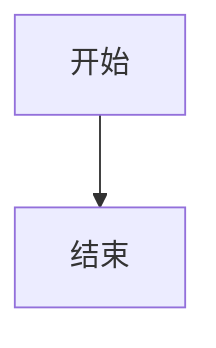

这是一个展示如何编写 Markdown 文件的教程与示例，包括核心语法与常见扩展（GFM）。

# Markdown概述

## Markdown

Markdown 是一种轻量级标记语言，它允许人们使用易读易写的纯文本格式编写出结构化文档。

Markdown 语言在 2004 由约翰·格鲁伯（英语：John Gruber）与 Aaron Swartz 合作开发创建，在网站上被广泛使用。

## CommonMark

[CommonMark](https://commonmark.org/) 是一种为 Markdown 制定的严格、明确的语法规范和测试套件。

它的核心目标是解决原始 Markdown 因规范不清晰而导致的“方言”林立、跨平台渲染不一致的痛点。

## GFM

GitHub Flavored Markdown，通常缩写为 [GFM](https://gfm.docschina.org/)，是 Markdown 的方言，目前在 GitHub.com 和 GitHub Enterprise 上为用户内容而支持。

GFM 是 CommonMark 的严格超集。GitHub 用户内容中支持的所有功能以及未在原始 CommonMark 规范中指定的功能，因此被称为 **扩展**，并且如此突出显示。

# 一级标题

Markdown 标题有两种格式：

使用 `=` 标记一级标题，使用 `-` 标记 二级标题。

```markdown
一级标题
=================

二级标题
-----------------

```

使用 `#` 号标记。

```markdown
# 一级标题
## 二级标题
### 三级标题
#### 四级标题
##### 五级标题
###### 六级标题
```

二级标题
-----------------

### 三级标题

#### 四级标题

##### 五级标题

###### 六级标题

---

# 段落

## 段落

段落后面使用一个空行来表示重新开始一个段落。

```markdown
第一段落

第二段落
```

第一段落

第二段落

## 换行

在行尾添加两个及以上的空格表示换行，类似于直接加上 HTML 换行标签 `<br>`

```markdown
第一行  
第二行<br>第三行
```

第一行  
第二行<br>第二行

> 多使用「段落」标记，少用或者不用「换行」标记。

# 文本与着重

## 斜体

斜体字体表示强调或引用，通常用于书名、外语词汇等的强调。

斜体语法使用一个星号 `*` 或一个下划线 `_` 包围文字。

```markdown
*斜体文本*

_italic text_
```

*斜体文本*
_italic text_

> 建议在强调符号前后加空格以提高可读性

## 粗体

加粗字体可以使重要信息更加突出。

粗体语法使用一个星号 `**` 或一个下划线 `__` 包围文字。

```markdown
**粗体文本**

__bord text__
```

**粗体文本**

__bord text__

> 建议在强调符号前后加空格以提高可读性

## 粗斜体组合

粗斜体组合可以使用三个星号 `***` 或三个下划线 `___` 包围文字。

```markdown
***粗斜体***

___italic bord text___
```

***粗斜体***
___italic bord text___

> 建议在强调符号前后加空格以提高可读性

## 删除线

在文字的两端加上两个波浪线 `~~` 表示文字已过时或删除

```markdown
普通文字

~~删除的文字~~
```

普通文字

~~删除的文字~~

## 下划线

Markdown 没有内置的下划线语法，但可以通过 html 标签 `<u>` 实现。

用下划线可能会干扰阅读，因此应尽量少用。

```markdown
<u>带下划线的文本</u>
```

<u>带下划线的文本</u>

## 高亮

文本高亮不是标准 Markdown 语法，但许多扩展支持，或是通过 HTML 实现：

```
这是 ==高亮文本==

这是 <mark>高亮文本</mark>
```

这是 ==高亮文本==

这是 <mark>高亮文本</mark>

# 列表

Markdown 支持有序列表和无序列表。

## 无序列表

无序列表使用星号 `*`、加号 `+` 或是减号 `-` 作为列表标记，这些标记后面要添加一个空格，然后再填写内容。

```markdown
* 第一项
* 第二项
* 第三项

+ 第一项
+ 第二项
+ 第三项

- 第一项
- 第二项
- 第三项
```

* 第一项
* 第二项
* 第三项

+ 第一项
+ 第二项
+ 第三项

- 第一项
- 第二项
- 第三项

> 建议：
>
> 1. 统一使用减号 `-`，因为它在视觉上更清晰
> 2. 在同一文档中保持一致的标记方式

## 有序列表

有序列表使用数字并加上点 `.` 来表示。

```markdown
1. 第一项
2. 第二项
3. 第三项
```

1. 第一项
2. 第二项
3. 第三项

Markdown 会从开头数字开始，自动修正数字顺序。

```markdown
4. 第四项
6. 第六项（实际显示为5）
8. 第八项（实际显示为6）
```

4. 第四项
6. 第六项（实际显示为5）
8. 第八项（实际显示为6）

## 列表嵌套

列表嵌套只需在子列表中的选项前面添加四个空格即可。

```markdown
1. 第一项：
    - 第一个子项
        1. 第一个子子项
        2. 第一个子子项
    - 第一个子项
2. 第二项：
    1. 第一个子项
    2. 第二个子项
```

1. 第一项：
    - 第一个子项
        1. 第一个子子项
        2. 第一个子子项
    - 第一个子项
2. 第二项：
    1. 第一个子项
    2. 第二个子项

> 建议：
>
> 1. 子列表需要缩进 2-4 个空格
> 2. 保持一致的缩进长度
> 3. 可以无限层嵌套，但实际使用中建议不超过 3 层

## 清单列表

清单列表再选项前面加 `- [ ]` 实现可勾选的列表。

```markdown
- [ ] 未选择
- [x] 已选择
```

- [ ] 未选择
- [x] 已选择

# 引用

引用块用于突出显示重要信息、引用他人观点或创建视觉层次。

## 引用块

区块引用是在段落开头使用 `>` 符号 ，然后后面紧跟一个 **空格** 符号：

区块内可以使用 **其他语法**。

```markdown
> 这是引用内容
> 这是引用内容
> 这是引用内容
>
> 引用区块中的列表：
>
> 1. 第一项
> 2. 第二项
>    1. 第一个元素
>    2. 第二个元素
>
> 引用区块中的代码：
>
> ``` bash
> echo hello world
> ```
```

> 这是引用内容
> 这是引用内容
> 这是引用内容
>
> 引用区块中的列表：
>
> 1. 第一项
> 2. 第二项
>    1. 第一个元素
>    2. 第二个元素
>
> 引用区块中的代码：
> ```bash
> echo hello world
> ```

## 列表中的引用块

如果要在列表项目内放进区块，那么就需要在 `>` 前添加四个空格的缩进。

```markdown
1. 第一项
   > 区块引用
2. 第二项
   > 区块引用
```

1. 第一项
   > 区块引用
2. 第二项
   > 区块引用

## 嵌套引用块

一个 `>` 符号是最外层，两个 `>` 符号是第一层嵌套。

```markdown
> 最外层
> > 第一层嵌套
> > > 第二层嵌套
```

> 最外层
> > 第一层嵌套
> > > 第二层嵌套

# 代码

## 行内代码

如果是段落上的一个函数或片段的代码可以用反引号把它包起来。

```
在这个段落中我们提到了 `print()` 函数
```

在这个段落中我们提到了 `print()` 函数

## 反引号转义

当需要在行内代码中显示反引号或其他特殊字符时，需要进行转义处理。

使用多个反引号包围反引号。

```
``多个反引号 `包围 ``
```

``多个反引号 ` 包围 ``

> 在行内代码中无法使用反斜杠转义

## 缩进式代码区块

缩进式代码区块使用 4 个空格或者一个制表符（Tab 键）。

```markdown
正常文本段落

    这是缩进式代码块
    每行前面有四个空格
    保持代码的原始格式
    
正常文本段落
```

正常文本段落

    这是缩进式代码块
    每行前面有四个空格
    保持代码的原始格式

正常文本段落

## 三反引号代码块

可以用 **```** 包裹一段代码，并指定一种语言（也可以不指定）：

~~~markdown
```
多行代码内容
可以包含空行
保持原有缩进
```
```txt
普通文本
```
```java
public class TestCode() {
	public static void main(String[] args) {
		System.out.println("测试打印")；
	}
}
```
```javascript
$(document).ready(function () {
    alert('RUNOOB');
});
```
~~~

```
多行代码内容
可以包含空行
保持原有缩进
```
```txt
普通文本
```
```java
public class TestCode() {
	public static void main(String[] args) {
		System.out.println("测试打印")；
	}
}
```
```javascript
$(document).ready(function () {
    alert('RUNOOB');
});
```

# 链接

链接语法可以为 Markdown 文档提供交互性的导航功能。

## 使用中括号 `[]` 和括弧 `()`

```markdown
这是一个链接 [baidu](https://www.baidu.com "链接标题")
```

这是一个链接 [baidu](https://www.baidu.com "链接标题")

## 使用砖石符号 `<>`

```markdown
这是一个链接 <https://www.baidu.com>
```

这是一个链接 <https://www.baidu.com>

## 自动链接识别

现代 Markdown 解析器通常支持自动识别 URL 和邮箱地址

```markdown
网址：https://www.example.com

邮箱：example@email.com
```

网址：https://www.example.com
邮箱：example@email.com

> 自动识别功能依赖于具体的 Markdown 解析器，为了确保兼容性，建议使用标准的链接语法。

## 参考链接

我们可以通过变量来设置一个链接，变量赋值在文档末尾进行，类似于脚注。

```markdown
这个链接用第二个方括号 [a] 作为网址变量 [google][g]

这个链接省略第二个方括号作为网址变量 [baidu][]

[g]: http://www.google.com/
[baidu]: https://www.baidu.com/
```

这个链接用第二个方括号 [a] 作为网址变量 [google][g]

这个链接省略第二个方括号作为网址变量 [baidu][]

[g]: http://www.google.com/
[baidu]: https://www.baidu.com/

## 锚点链接

锚点链接用于在同一文档内跳转，特别适合长文档的导航。<span id="custom-anchor"> </span >

```markdown
<span id="custom-anchor"> </span >

跳转到标题 [Markdown概述](#Markdown概述)

跳转到自定义的锚点位置 [自定义位置](#自定义位置)

[回到顶部](#)
```

<span id="custom-anchor"> </span >

跳转到标题 [Markdown概述](#Markdown概述)

跳转到自定义的锚点位置 [自定义位置](#自定义位置)

[回到顶部](#)

# 注释

## 原生注释

```markdown
<!-- 这是一段被注释掉的文字 --> 

这是一段没有被注释的文字
```

<!-- 这是一段被注释掉的文字 --> 

这是一段没有被注释的文字

## 通过 Markdown 自身的解析功能

```
[//]: (这是一段被注释掉的文字)

这是一段没有被注释的文字
```

[//]: (这是一段被注释掉的文字)

这是一段没有被注释的文字

## 使用 HTML 样式实现隐藏

```
<div style="display:none"> 这是一段被注释掉的文字 </div>

这是一段没有被注释的文字
```

<div style="display:none"> 这是一段被注释掉的文字 </div>

这是一段没有被注释的文字

# 图片

## 引用与展示图片

使用 `` 引用图片

```markdown
本地图片


网络图片（图床图片）

```

本地图片


网络图片（图床图片）


## 指定图片属性

Markdown 还没有办法指定图片的属性，如果你需要的话，你可以使用 HTML 的 `` 标签。

```markdown

```


# 表格

表格能够清晰地展示结构化数据，而引用则用于突出重要信息或引用他人观点。

## 制作表格

Markdown 制作表格使用 `|` 来分隔不同的单元格，使用 `-` 来分隔表头和其他行。

```markdown
| 表头   | 表头   | 表头   |
| ------ | ------ | ------ |
| 单元格 | 单元格 | 单元格 |
| 单元格 | 单元格 | 单元格 |
| 单元格 | 单元格 | 单元格 |
```

| 表头   | 表头   | 表头   |
| ------ | ------ | ------ |
| 单元格 | 单元格 | 单元格 |
| 单元格 | 单元格 | 单元格 |
| 单元格 | 单元格 | 单元格 |

**我们可以设置表格的对齐方式：**

| 左对齐 | 右对齐 | 居中对齐 |
| :----- | -----: | :------: |
| 单元格 | 单元格 |  单元格  |
| 单元格 | 单元格 |  单元格  |
| 单元格 | 单元格 |  单元格  |

## 表格对齐方式

`---:` 设置内容和标题栏居右对齐。
`:---` 设置内容和标题栏居左对齐。
`:---:` 设置内容和标题栏居中对齐。

```markdown
| 左对齐 | 右对齐 | 居中对齐 |
| :-----| ----: | :----: |
| 单元格 | 单元格 | 单元格 |
| 单元格 | 单元格 | 单元格 |
```

| 左对齐 | 右对齐 | 居中对齐 |
| :----- | -----: | :------: |
| 单元格 | 单元格 |  单元格  |
| 单元格 | 单元格 |  单元格  |

## 表格内容多元化

| 内容           | 示例                                  |
| -------------- | ------------------------------------- |
| 文本强调       | **粗体** *斜体* ~~删除线~~<u>下划线</u> |
| 链接           | [链接](http://www.example.com)        |
| HTML 字符代码   | &#x2705;                              |
| Emoji 简码     | :stuck_out_tongue_winking_eye:        |
| Emoji 直接复制 | 😳                                     |

## 竖线转义

您可以使用表格的 HTML 字符代码或者反斜杠转义在表中显示竖线 `|` 字符。

```markdown
| 转义方法 | 示例             |
| -------- | ---------------- |
| `\|`     | 显示 \| 符号     |
| `&#124;` | 显示 &#124; 符号 |
```

| 转义方法         | 示例             |
| ---------------- | ---------------- |
| 反斜杠转义 `\|`   | 显示 \| 符号     |
| 字符代码 `&#124;` | 显示 &#124; 符号 |

# HTML

不在 Markdown 涵盖范围之内的标签，都可以直接在文档里面用 HTML 撰写。

## 行内级联标签

HTML 的行级內联标签如 `<span>`、`<cite>`、`<del>` 不受限制，可以在 Markdown 的段落、列表或是标题里任意使用。依照个人习惯，甚至可以不用 Markdown 格式，而采用 HTML 标签来格式化。

```markdown
表示按键组合：<kbd> Ctrl </kbd>+<kbd> Alt </kbd>+<kbd> Del </kbd>  
表示粗体：<b>加粗文本</b>  
表示斜体：<i>斜体文本</i>  
表示语义强调：<em>被强调的文本</em>  
添加上标和下标：<sup>上标</sup><sub>下标</sub>  
表示链接：<a>http://www.example.com</a>  
表示换行：第一行<br>第二行
```

表示按键组合：<kbd> Ctrl </kbd>+<kbd> Alt </kbd>+<kbd> Del </kbd>  
表示粗体：<b>加粗文本</b>  
表示斜体：<i>斜体文本</i>  
表示语义强调：<em>被强调的文本</em>  
添加上标和下标：<sup>上标</sup><sub>下标</sub>  
表示链接：<a>http://www.example.com</a>  
表示换行：第一行<br>第二行

## 区块标签

区块元素 ── 比如 `<div>`、`<table>`、`<pre>`、`<p>` 等标签，必须在前后加上空行，以便于内容区分。

```markdown
这是一个正常段落。

<table>
    <tr>
        <td>Foo</td>
    </tr>
</table>

这是另一个正常段落。
```

这是一个正常段落。

<table>
    <tr>
        <td> 示例 </td>
    </tr>
</table>
这是另一个正常段落。

## HTML实体

Markdown 不能直接插入特殊符号，但可以复制粘贴，或者使用 HTML 实体：

```
版权 (©) — &copy;  
注册商标 (®) — &reg;  
商标 (™) — &trade;  
欧元 (€) — &euro;  
左箭头 (←) — &larr;  
上箭头 (↑) — &uarr;  
右箭头 (→) — &rarr;  
下箭头 (↓) — &darr;  
度数 (°) — &#176;  
圆周率 (π) — &#960;
```

版权 (©) — &copy;  
注册商标 (®) — &reg;  
商标 (™) — &trade;  
欧元 (€) — &euro;  
左箭头 (←) — &larr;  
上箭头 (↑) — &uarr;  
右箭头 (→) — &rarr;  
下箭头 (↓) — &darr;  
度数 (°) — &#176;  
圆周率 (π) — &#960;

# 其他

## 分隔线

用三个以上的星号 `*`、减号 `-` 来建立一个分隔线，行内不能有其他东西。

```markdown
***

* * *

********

---

- - -

--------
```

***

* * *

**** ****

---

- - -

--------

## 脚注

脚注是对文本的补充说明，通过 `[^ 替代文本] ` 创建

```markdown
需要补充说明的内容 [^ 1]

[^ 1]: 这里是脚注内容
```

需要补充说明的内容 [^ 1]

[^ 1]: 这里是脚注内容

## 转义

要显示原本用于格式化 Markdown 文档的字符，请在字符前面添加反斜杠字符 `\` ，使用反斜杠转义特殊字符

```markdown
| 符号 | 名称                                                        |
| :--- | :---------------------------------------------------------- |
| \    | 反斜线                                                      |
| `    | 反引号（在代码块中显示反引号详见[反引号转义](#反引号转义)） |
| *    | 星号                                                        |
| _    | 下划线                                                      |
| { }  | 花括号                                                      |
| [ ]  | 方括号                                                      |
| ( )  | 小括号                                                      |
| #    | 井字号                                                      |
| +    | 加号                                                        |
| -    | 减号                                                        |
| .    | 英文句点                                                    |
| !    | 感叹号                                                      |
| \|   | 竖线 （在表格中显示竖线详见[竖线转义](#竖线转义)）          |
```

| 符号 | 名称                                                         |
| :--- | :----------------------------------------------------------- |
| \    | 反斜线                                                       |
| `    | 反引号（在代码块中显示反引号，详见[反引号转义](#反引号转义)） |
| *    | 星号                                                         |
| _    | 下划线                                                       |
| { }  | 花括号                                                       |
| [ ]  | 方括号                                                       |
| ( )  | 小括号                                                       |
| #    | 井字号                                                       |
| +    | 加号                                                         |
| -    | 减号                                                         |
| .    | 英文句点                                                     |
| !    | 感叹号                                                       |
| \|   | 竖线 （在表格中显示竖线，详见 [竖线转义](#竖线转义)）         |

## Emoji

有两种方法可以将表情符号添加到 Markdown 文件中：将表情符号复制并粘贴到 Markdown 格式的文本中，或者键入 *emoji shortcodes*。

```
键入表情简码：:joy:

直接复制：😂
```

键入表情简码：:joy:

直接复制：😂

## 公式

LaTeX 是一个强大的排版系统，特别适用于包含复杂数学公式的文档。

当你需要在编辑器中插入数学公式时，可以使用一个或两个美元符 `$` 包裹 TeX 或 LaTeX 格式的数学公式来实现。

```markdown
行内公式：文本中的变量 $x = 5$ 和函数 $f(x) = x^2 + 2x + 1$。

块级公式：
$$E = mc^2$$

多行公式：
$$
\begin{align}
f(x) &= ax^2 + bx + c \\
f'(x)  &= 2ax + b \\
f''(x)  &= 2a
\end{align}
$$
					
```

行内公式：文本中的变量 $x = 5$ 和函数 $f(x) = x^2 + 2x + 1$。

块级公式：
$$E = mc^2$$

多行公式：
$$
\begin{align}
f(x) &= ax^2 + bx + c \\
f'(x)  &= 2ax + b \\
f''(x)  &= 2a
\end{align}
$$

## 图表

Mermaid（美人鱼），是一个类似 markdown，用文本语法来描述文档图形 (流程图、 时序图、甘特图) 的工具，您可以在文档中嵌入一段 mermaid 文本来生成 SVG 形式的图形

````markdown

````


# 参考链接

[^1]: [CommonMark - CommonMark 规范](https://commonmark.cn/)
[^2]: [GitHub Flavored Markdown Spec | GFM](https://gfm.docschina.org/)
[^3]: [Markdown 教程 | 菜鸟教程](https://www.runoob.com/markdown/md-tutorial.html)
[^4]: [Markdown教程 — 最简明的Markdown语法入门指南](https://markdown.com.cn/)