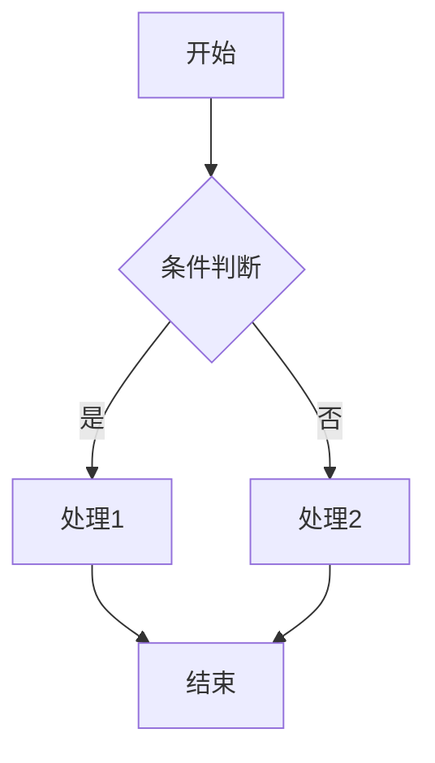
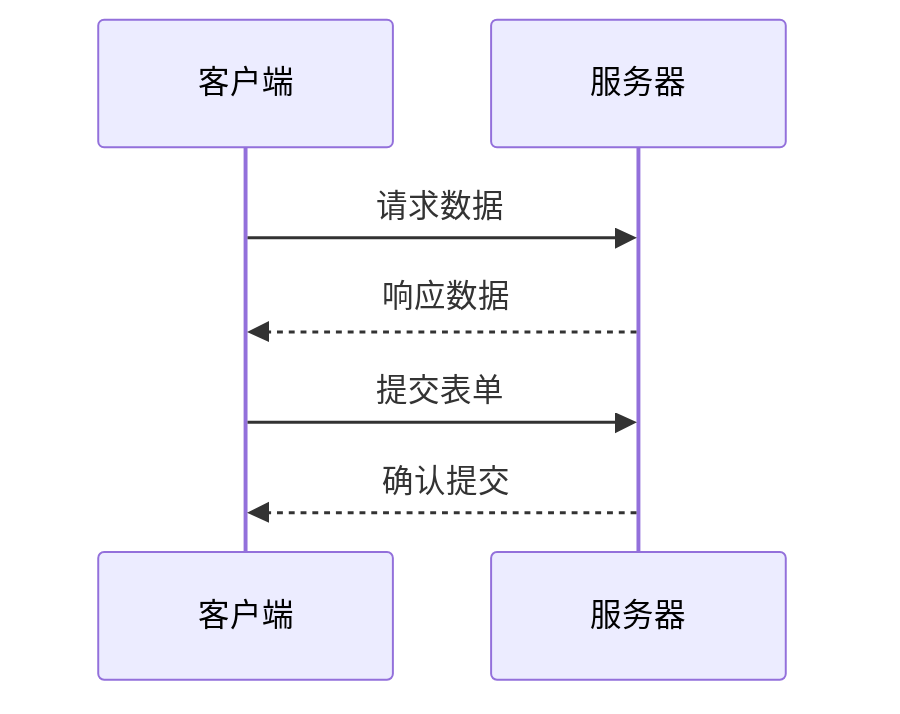
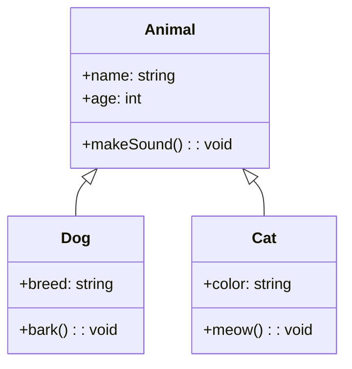
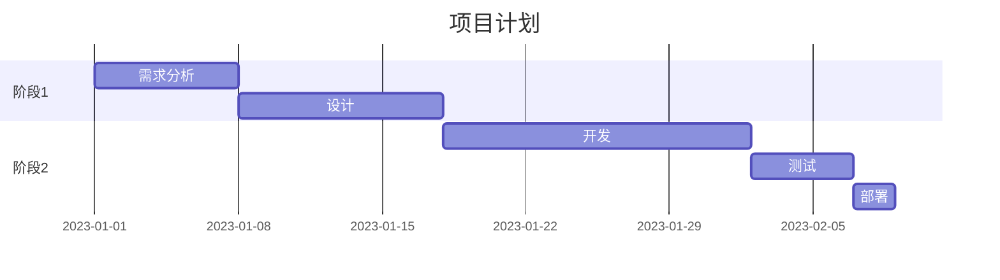
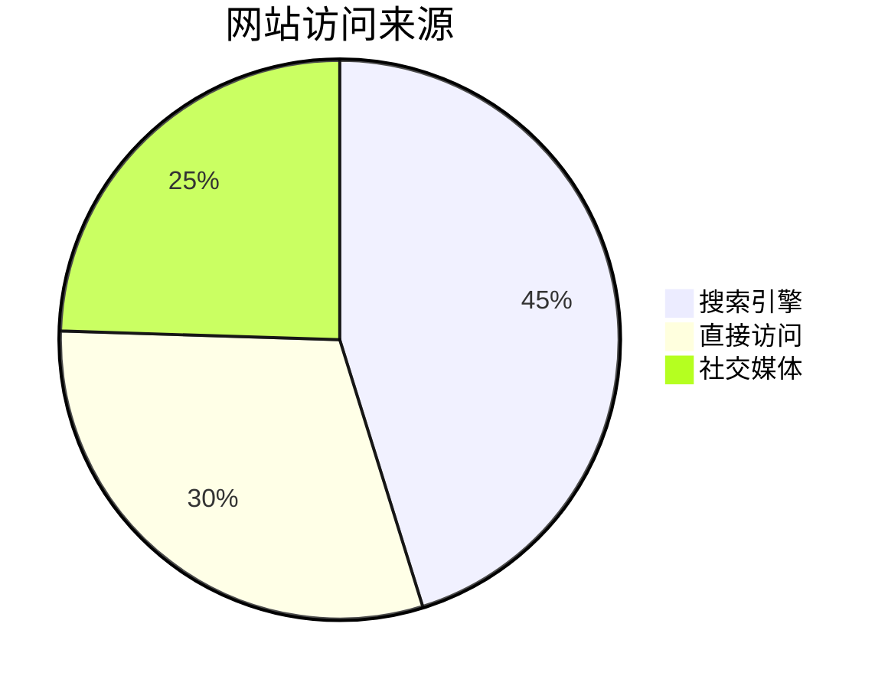
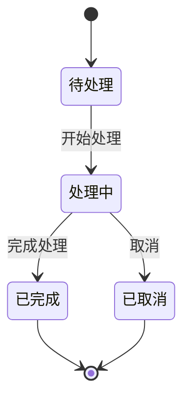
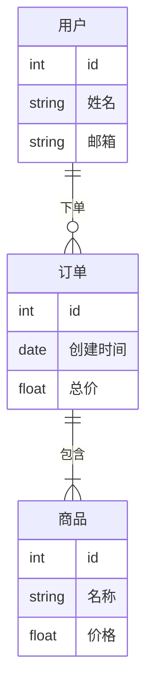
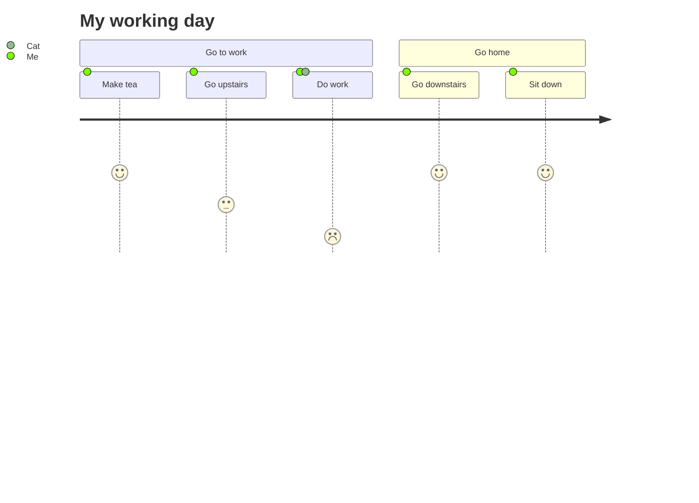
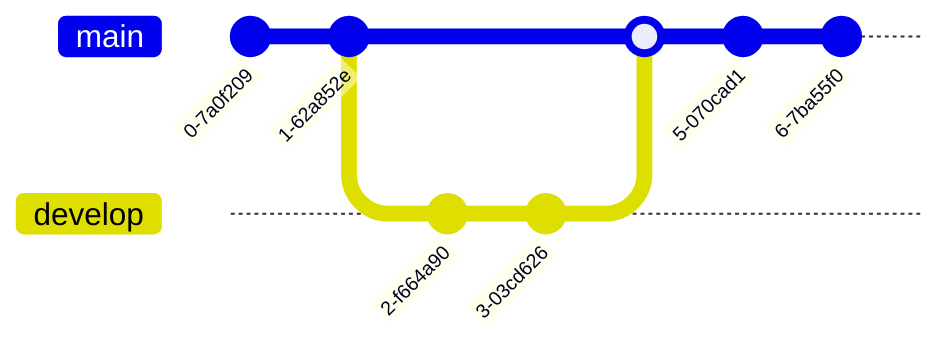

这是一个展示 Markdown 文件扩展语法（GFM）的示例。

# Markdown 扩展

## 容器

自定义容器可以通过它们的类型、标题和内容来定义。

### 信息框容器

```markdown
::: info
This is an info box.
:::

::: tip
This is a tip.
:::

::: warning
This is a warning.
:::

::: danger
This is a dangerous warning.
:::

::: details
This is a details block.
:::
```

::: info
This is an info box.
:::

::: tip
This is a tip.
:::

::: warning
This is a warning.
:::

::: danger
This is a dangerous warning.
:::

::: details
This is a details block.
:::

可以通过在容器的 "type" 之后附加文本来设置自定义标题

~~~markdown
::: danger STOP
危险区域，请勿继续
:::

::: details 点我查看代码
```js
console.log('Hello, VitePress!')
```
:::
~~~

::: danger STOP
危险区域，请勿继续
:::

::: details 点我查看代码
```js
console.log('Hello, VitePress!')
```
:::

## GitHub 风格的警报

```markdown
> [!NOTE]
> 强调用户在快速浏览文档时也不应忽略的重要信息。

> [!TIP]
> 有助于用户更顺利达成目标的建议性信息。

> [!IMPORTANT]
> 对用户达成目标至关重要的信息。

> [!WARNING]
> 因为可能存在风险，所以需要用户立即关注的关键内容。

> [!CAUTION]
> 行为可能带来的负面影响。
```

> [!NOTE]
> 强调用户在快速浏览文档时也不应忽略的重要信息。

> [!TIP]
> 有助于用户更顺利达成目标的建议性信息。

> [!IMPORTANT]
> 对用户达成目标至关重要的信息。

> [!WARNING]
> 因为可能存在风险，所以需要用户立即关注的关键内容。

> [!CAUTION]
> 行为可能带来的负面影响。

## 特殊代码块

### 语法高亮

````md
```js{4}
export default {
  data () {
    return {
      msg: 'Highlighted!'
    }
  }
}
```
````

```js{4}
export default {
  data () {
    return {
      msg: 'Highlighted!'
    }
  }
}
```

## Emoji

有两种方法可以将表情符号添加到 Markdown 文件中：将表情符号复制并粘贴到 Markdown 格式的文本中，或者键入 *emoji shortcodes*。

```
键入表情简码：:joy:

直接复制：😂
```

键入表情简码：:joy:

直接复制：😂

## 上下角标

```
19^th^

H~2~O
```

19^th^

H~2~O

## 脚注

脚注是对文本的补充说明，通过 `[^ 替代文本] ` 创建

```markdown
需要补充说明的内容 [^ 1]

[^1]: 这里是脚注内容
```

需要补充说明的内容 [^1]

[^1]: 这里是脚注内容

## 任务列表

清单列表再选项前面加 `- [ ]` 实现可勾选的列表。

```markdown
- [ ] 未选择
- [x] 已选择
```

- [ ] 未选择
- [x] 已选择

## 数学公式

LaTeX 是一个强大的排版系统，特别适用于包含复杂数学公式的文档。

当你需要在编辑器中插入数学公式时，可以使用一个或两个美元符 `$` 包裹 TeX 或 LaTeX 格式的数学公式来实现。

```markdown
行内公式：文本中的变量 $x = 5$ 和函数 $f(x) = x^2 + 2x + 1$。

块级公式：
$$E = mc^2$$

多行公式：
$$
\begin{align}
f(x) &= ax^2 + bx + c \\
f'(x)  &= 2ax + b \\
f''(x)  &= 2a
\end{align}
$$
					
```

行内公式：文本中的变量 $x = 5$ 和函数 $f(x) = x^2 + 2x + 1$。

块级公式：
$$E = mc^2$$

多行公式：
$$
\begin{align}
f(x) &= ax^2 + bx + c \\
f'(x)  &= 2ax + b \\
f''(x)  &= 2a
\end{align}
$$

## 图表

[Mermaid](https://mermaid.js.org/#/)（美人鱼）是一个基于 JavaScript 的图表和图形工具，允许用文本语法来描述文档图形 (流程图、 时序图、甘特图) 的工具，您可以在文档中嵌入一段 mermaid 文本来生成 SVG 形式的图形

### 流程图（Flowchart）

流程图用于表示流程或算法。

````markdown
``` mermaid
flowchart TD
    A [开始] --> B{条件判断}
    B -->|是| C [处理 1]
    B -->|否| D [处理 2]
    C --> E [结束]
    D --> E
```
````



### 时序图（Sequence Diagram）

时序图用于显示对象之间的交互，按时间顺序排列。

~~~markdown

~~~


### 类图（Class Diagram）

类图用于显示系统中的类、属性、方法以及它们之间的关系。

~~~markdown

~~~


### 甘特图（Gantt Chart）

甘特图用于项目管理，显示项目、任务和里程碑的时间线。

~~~markdown

~~~


### 饼图（Pie Chart）

饼图用于显示数据的比例关系。

~~~markdown

~~~


### 状态图（State Diagram）

状态图用于描述系统或对象的不同状态及其转换。

~~~markdown

~~~


### 实体关系图（Entity Relationship Diagram）

ER 图用于数据库设计，显示实体及其关系。

~~~markdown

~~~


### 旅程图（Journey Diagram）

旅程图用于显示用户体验或流程中的不同阶段和满意度。

~~~markdown

~~~


### git 图表（Git Graph）

~~~markdown

~~~



## 参考资料

[Markdown 增强](https://vuepress-theme-hope.github.io/v1/md-enhance/zh/)

[在 VitePress 中使用 Mermaid 图表 | Jay's Blog](https://liubinfighter.github.io/Resource/Archive/mermaid-guide.html)

