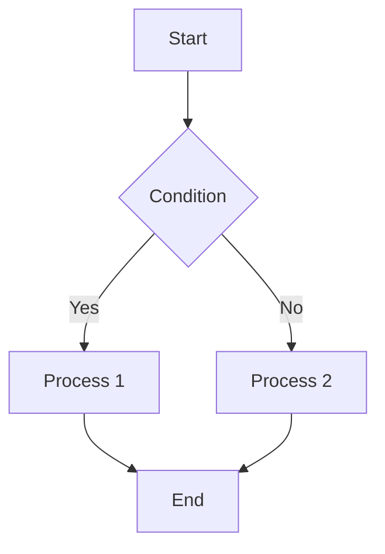
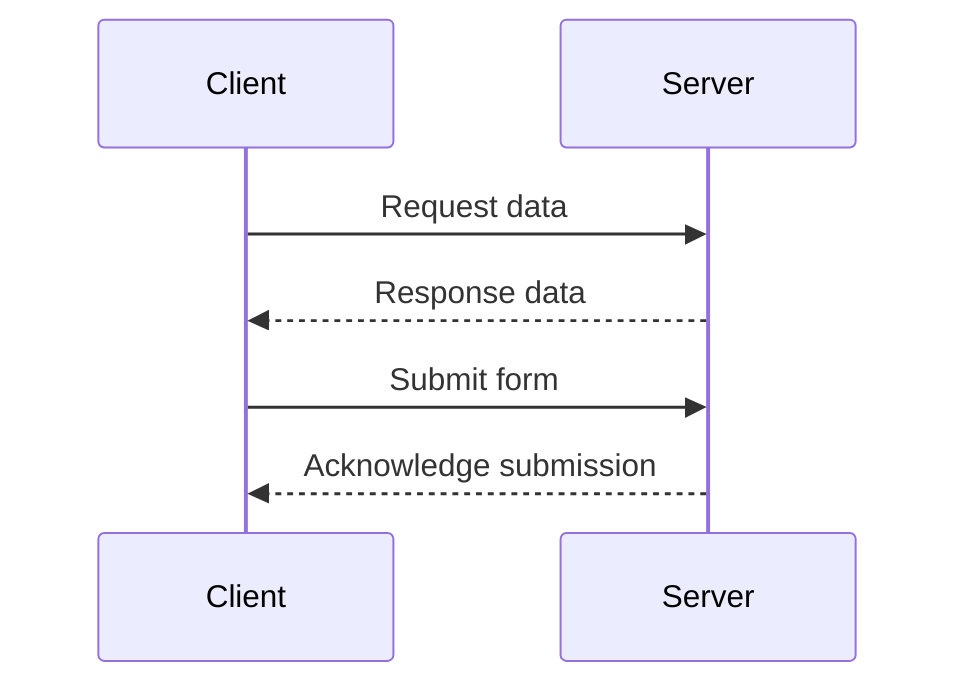
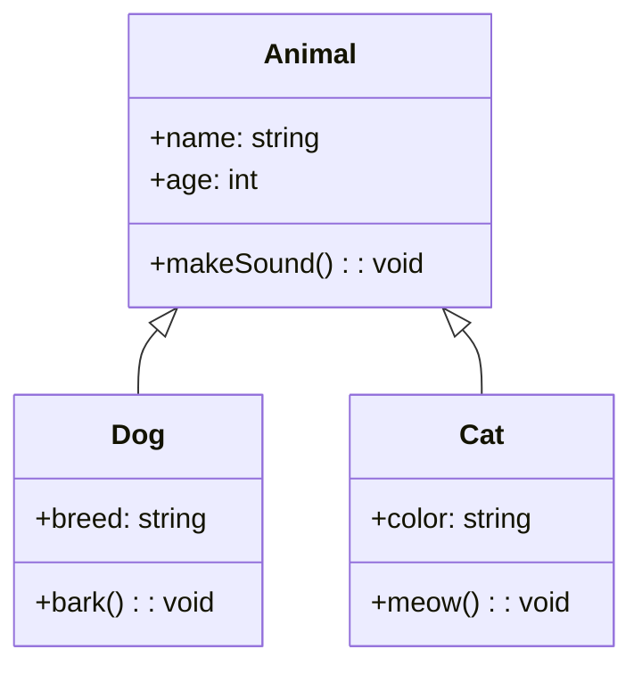
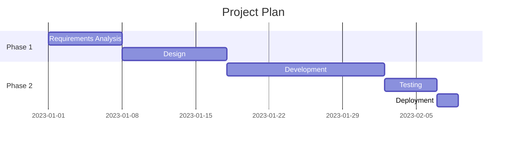
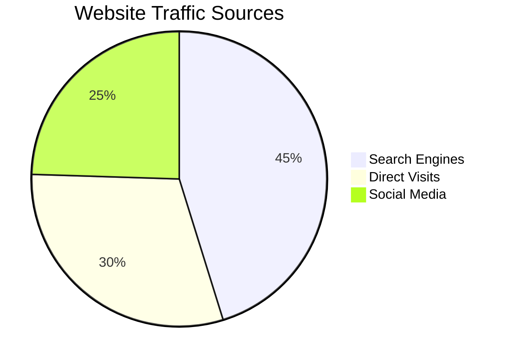
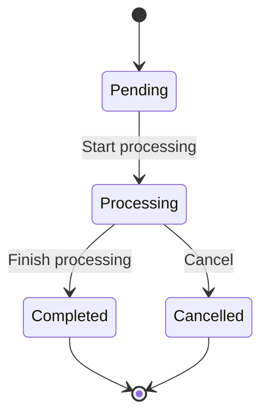
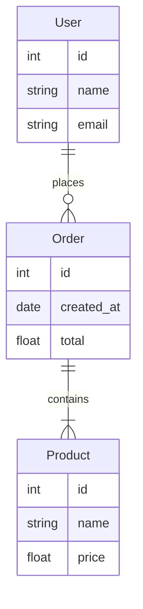
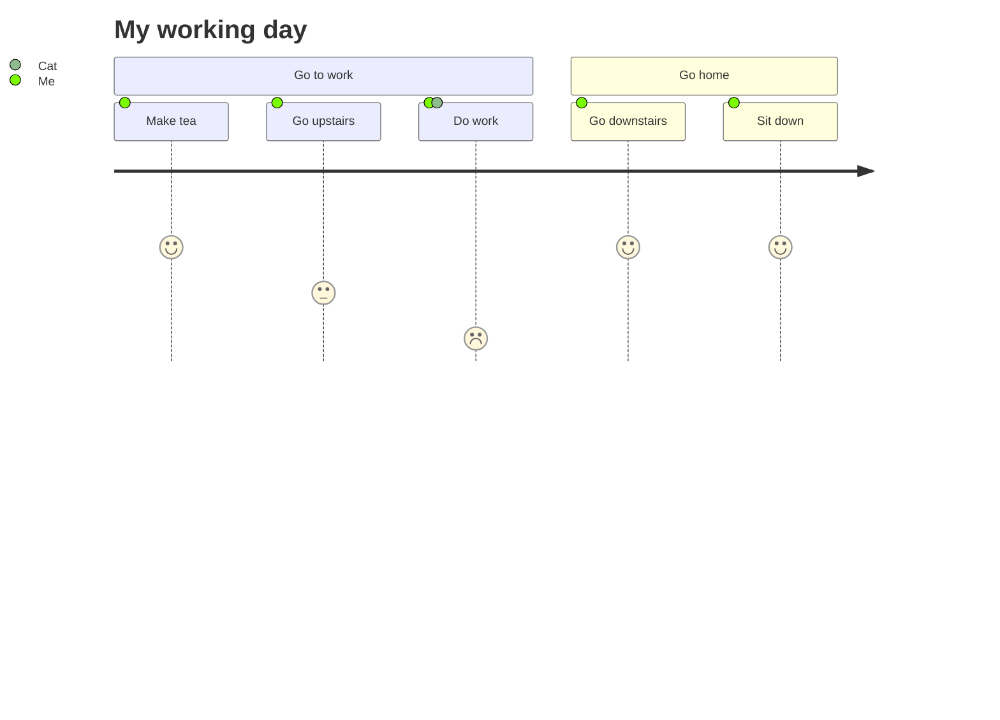
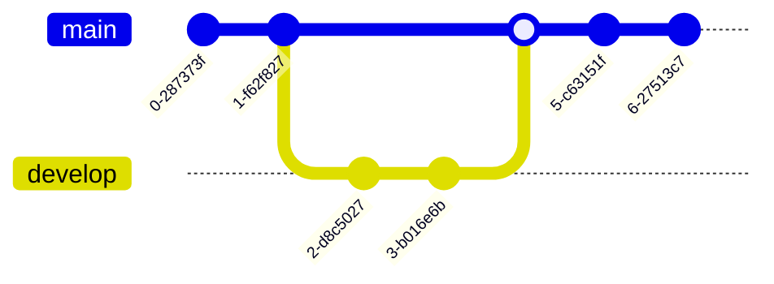
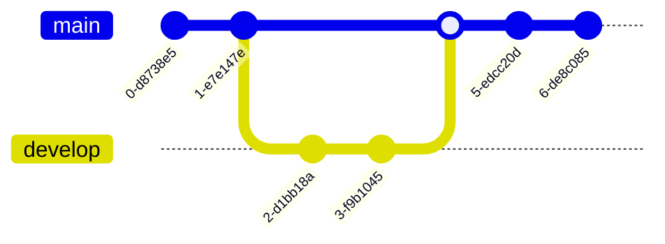

# Markdown Extensions

## Containers

Custom containers can be defined by their type, title, and content.

### Info Box Containers

```markdown
::: info
This is an info box.
:::

::: tip
This is a tip.
:::

::: warning
This is a warning.
:::

::: danger
This is a dangerous warning.
:::

::: details
This is a details block.
:::
```

::: info
This is an info box.
:::

::: tip
This is a tip.
:::

::: warning
This is a warning.
:::

::: danger
This is a dangerous warning.
:::

::: details
This is a details block.
:::

You can set a custom title by appending text after the container "type".

~~~markdown
::: danger STOP
Danger zone, do not proceed
:::
```

::: details Click to view code
```js
console.log('Hello, VitePress!')

:::
~~~

::: danger STOP
Danger zone, do not proceed
:::

::: details Click to view code
```js
console.log('Hello, VitePress!')
```
:::

## GitHub-Style Alerts

```markdown
> [!NOTE]
> Highlights important information that users should not ignore even when skimming through documents.

> [!TIP]
> Suggestive information that helps users achieve their goals more smoothly.

> [!IMPORTANT]
> Information crucial for users to achieve their goals.

> [!WARNING]
> Critical content requiring immediate user attention due to potential risks.

> [!CAUTION]
> Potential negative consequences of an action.
```

> [!NOTE]
> Highlights important information that users should not ignore even when skimming through documents.

> [!TIP]
> Suggestive information that helps users achieve their goals more smoothly.

> [!IMPORTANT]
> Information crucial for users to achieve their goals.

> [!WARNING]
> Critical content requiring immediate user attention due to potential risks.

> [!CAUTION]
> Potential negative consequences of an action.

## Special Code Blocks

### Syntax Highlighting

````md
```js{4}
export default {
  data () {
    return {
      msg: 'Highlighted!'
    }
  }
}
```
````

```js{4}
export default {
  data () {
    return {
      msg: 'Highlighted!'
    }
  }
}
```

## Emoji

There are two ways to add emoji to Markdown files: copy and paste the emoji into the Markdown-formatted text, or type *emoji shortcodes*.

```
Type emoji shortcode: :joy:

Direct copy: 😂
```

Type emoji shortcode: :joy:

Direct copy: 😂

## Superscript & Subscript

```
19^th^

H~2~O
```

19^th^

H~2~O

## Footnotes

Footnotes provide supplementary explanations to the text, created with `[^anchor text]`.

```markdown
Content requiring a footnote [^1]

[^1]: This is the footnote content
```

Content requiring a footnote [^1]

[^1]: This is the footnote content

## Task Lists

Add `- [ ]` before items in a checklist to create checkable lists.

```markdown
- [ ] Unchecked
- [x] Checked
```

- [ ] Unchecked
- [x] Checked

## Math Formulas

LaTeX is a powerful typesetting system, especially suitable for documents containing complex mathematical formulas.

When you need to insert mathematical formulas in the editor, wrap TeX or LaTeX formatted formulas with one or two dollar signs `$`.

```markdown
Inline formula: variable $x = 5$ and function $f(x) = x^2 + 2x + 1$ in text.

Block-level formula:
$$E = mc^2$$

Multi-line formula:
$$
\begin{align}
f(x) &= ax^2 + bx + c \\
f'(x)  &= 2ax + b \\
f''(x)  &= 2a
\end{align}
$$
```

Inline formula: variable $x = 5$ and function $f(x) = x^2 + 2x + 1$ in text.

Block-level formula:
$$E = mc^2$$

Multi-line formula:
$$
\begin{align}
f(x) &= ax^2 + bx + c \\
f'(x)  &= 2ax + b \\
f''(x)  &= 2a
\end{align}
$$

## Diagrams

[Mermaid](https://mermaid.js.org/#/) is a JavaScript-based diagramming and charting tool that allows you to describe diagrams using text syntax (flowcharts, sequence diagrams, Gantt charts). You can embed a Mermaid snippet in your document to generate SVG graphics.

### Flowchart

Flowcharts are used to represent processes or algorithms.

````markdown

````


### Sequence Diagram

Sequence diagrams show interactions between objects, arranged in chronological order.

~~~markdown

~~~


### Class Diagram

Class diagrams display classes, attributes, methods, and their relationships in a system.

~~~markdown

~~~


### Gantt Chart

Gantt charts are used for project management, showing timelines for projects, tasks, and milestones.

~~~markdown

~~~


### Pie Chart

Pie charts display proportional relationships in data.

~~~markdown

~~~


### State Diagram

State diagrams describe different states of a system or object and their transitions.

~~~markdown

~~~


### Entity Relationship Diagram

ER diagrams are used for database design, showing entities and their relationships.

~~~markdown

~~~


### Journey Diagram

Journey diagrams show different stages and satisfaction levels in a user experience or process.

~~~markdown

~~~


### Git Graph

~~~markdown

~~~



## References

[Markdown Enhancements](https://vuepress-theme-hope.github.io/v1/md-enhance/)

[Using Mermaid Diagrams in VitePress | Jay's Blog](https://liubinfighter.github.io/Resource/Archive/mermaid-guide.html)
